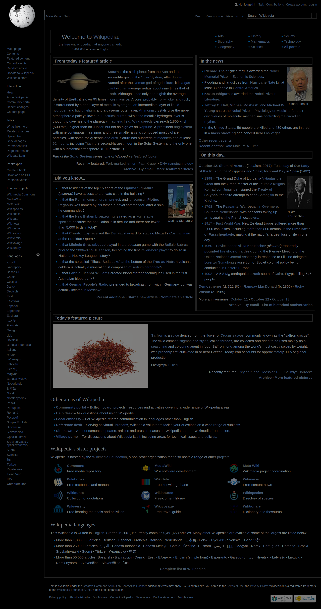

# blacks

a global black theme for the web

to disable theme for the current page use `Ctrl+Shift+E` 

# installation
currently there is no extensions, you have to manually load it

if you use vimium and goldendict run `setup.sh`
```
git clone https://github.com/raoofha/blacks
cd blacks
sh setup.sh
```
# screenshot




